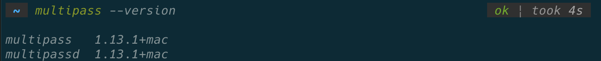
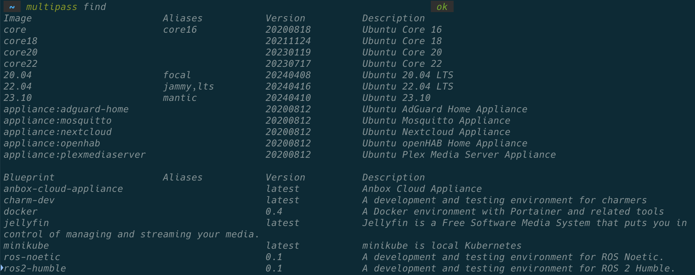
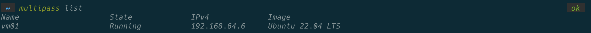
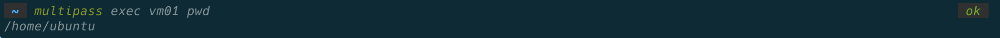
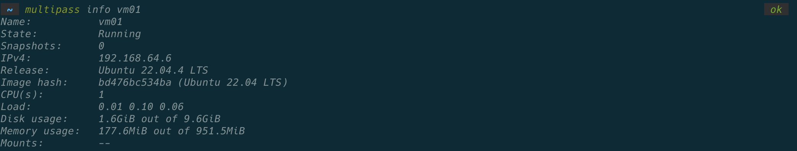
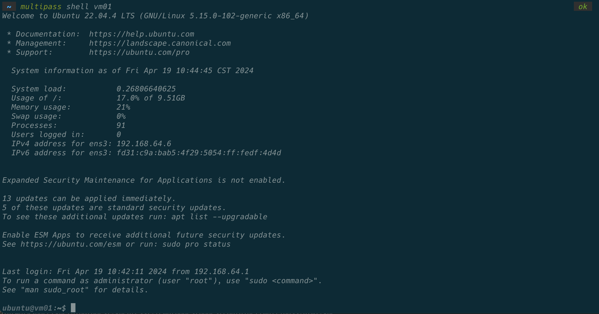

# Multipass

> multipass 是一款轻量级的虚拟机工具，可以快速创建和管理虚拟机，而无需进行复杂的配置。

## 安装

1. 方式一： 直接下载官方安装包： [Download Multipass for MacOS](https://multipass.run/install)

2. 方式二： 使用 Homebrew 安装：

   ```bash
   brew install --cask multipass
   ```

安装完成后，可以执行以下命令查看当前软件版本：

```bash
multipass --version
```

输出结果如下：


## 创建 Ubuntu 虚拟机

首先，通过一下指令查看可供下载的 Ubuntu 镜像：

```bash
multipass find
```

运行成功后，可以看到下面的镜像列表，包含各种版本：


启动一个容器: 初次创建时需要下载 ubunut 镜像

```bash
multipass launch -n [vm-01] ([image-version] -c 2 -m 2G -d 10G)
```

自定义配置：

- image-version: 镜像版本
- -n: --name 名称
- -c: --cpus CPU 核数
- -m: --memory 内存大小 默认：1G
- -d: --disk 磁盘大小 默认：5G

## 操作虚拟机

### 1. 查看虚拟机列表

```bash
multipass list
```

输出：


### 2. 外部操作虚拟机

```bash
# multipass exec [vm01] [cmd]
multipass exec vm01 pwd
```

输出：


### 3. 查看虚拟机信息

```bash
multipass info vm01
```

输出：


### 4. 进入虚拟机

```bash
multipass shell vm01
```

输出：


### 4. 数据卷

#### 4.1 挂载

```bash
# multipass mount [host-path] [vm:vmpath]
multipass mount /Users/[user]/[path]/[folder] vm01:/home/[user]/[folder]
```

#### 4.2 卸载

```bash
multipass unmount [vm]
```

### 5. 传输文件

```bash
multipass transfer [host-path] [vm:vmpath]
```

### 6. 实例相关

#### 6.1 启动实例

```bash
multipass start [vm]
```

#### 6.2 停止实例

```bash
multipass stop [vm]
```

#### 6.3 删除实例

```bash
multipass delete [vm]
multipass purge #命令用于删除所有已删除的实例，包括未启动的实例。
```
